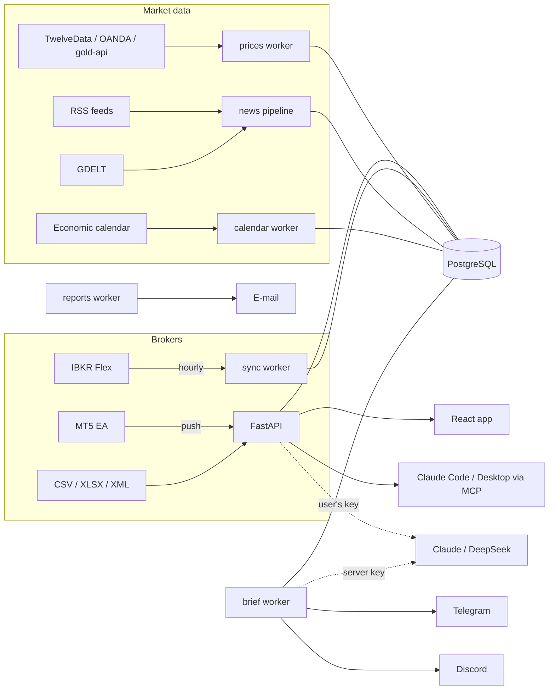

<div align="center">

# AI Trading & Investing Platform

**GoldTape — the AI trading desk for gold & silver traders — plus the signal bot and the strategy research behind it.**

Journal · Portfolio · Prop-firm guard · Morning brief · AI coach · Claude Code integration · Backtesting

[](https://github.com/mrmatek11/ai-trading-investing-platform/actions/workflows/ci.yml)


</div>

---

| Part | Where | What it is |
|---|---|---|
| **GoldTape** | [`tape/`](tape/) | Web platform for XAU/XAG traders: synced journal, analytics, portfolio, prop-firm limits, morning brief, AI review, MCP server |
| **Signal bot** | root (`bot.py`, `strategy/`, `analysis/`, …) | Multi-asset signal bot (NWO + Stochastic + CVD) with Discord alerts — [docs/SIGNAL_BOT.md](docs/SIGNAL_BOT.md) |
| **Backtester & research** | `backtest.py`, [`research/`](research/) | Walk-forward backtester with costs and significance tests; gold swing and intraday studies — [docs/BACKTEST_RESULTS.md](docs/BACKTEST_RESULTS.md) |
| **Product docs** | [`docs/`](docs/) | [Product spec](docs/PRODUCT_SPEC.md), [research notes](docs/RESEARCH.md), [GoldTape technical docs](tape/README.md) |

## GoldTape

Most trading tools are built for every market. GoldTape is built for the people who trade **XAU and XAG** all day: it syncs
their broker accounts, tells them where their edge actually is, watches their prop-firm limits in real time and briefs them
every morning on what will move metals today — in the app, on **Telegram** and on **Discord**.

The AI layer follows one rule: **code computes the facts, AI interprets them.** Every AI statement cites numbered facts
(`F1`, `F2`, …). If it contains a number that is not in the cited facts, it is dropped before the user sees it.

### 📒 Journal that syncs itself
- **MetaTrader 5** — a small Expert Advisor (`TapeSync.mq5`) pushes deals and live equity every tick; only a hash of its token is stored.
- **Interactive Brokers** — Flex Web Service, synced hourly; credentials encrypted with AES-256-GCM envelope encryption and key rotation.
- **File import** — XTB, cTrader, MT5, IBKR Flex XML, or *any* CSV/XLSX: column mapping by heuristics or AI, with preview and confirmation.
- FIFO position engine on `Decimal` (scale-ins, partial closes, reversals), R-multiples from the initial stop, multiple accounts kept apart.
- Playbooks with rule checklists, a taxonomy of mistakes and the **cost of each mistake** in dollars.

### 📊 Analyst dashboard
- Expectancy, payoff, profit factor, drawdown depth and duration, streaks, Sharpe/Sortino (daily), R distribution, rolling expectancy.
- P&L calendar, hour-of-day and weekday breakdowns, **"trades within ±30 min of US data"** segment.
- Every segment is tested against the rest (t-stat): small samples are labelled as hypotheses, not conclusions.

### 🛡️ Prop-firm guard
- Daily loss and max drawdown (static / trailing) evaluated **for today** in the firm's timezone, including floating P&L from MT5.
- Warning/danger bars on the dashboard and e-mail alerts at ≤ 25 % headroom — at most once per account per day.

### 💼 Portfolio
- Gold/silver exposure in ounces and USD, open lots marked to spot, deposits and withdrawals from brokers or manual entries.
- Monthly returns (Modified Dietz) chained into a time-weighted return.

### ☀️ Morning brief — "what decides today"
Every trading day at 07:30 (configurable) GoldTape builds a brief from the economic calendar, gold/silver prices and the
last 18 hours of headlines (RSS + GDELT). The AI then writes:
- **What decides the day** — the one release or speech that sets the direction, and why;
- **Scenarios** for every release: *above forecast → …*, *below forecast → …* (dollar, real yields, Fed expectations);
- **A lean for XAU and XAG** (bullish / neutral / bearish) with its reasoning and the facts it is based on.

Delivered in the app, to a public **Telegram channel**, to each user's private Telegram chat (one-click link, `/brief`, `/stop`)
and to **Discord** webhooks. No buy/sell calls — it explains what is at stake and through which mechanism.

### 🤖 AI — bring your own model
- Each user connects their own **Claude** or **DeepSeek** API key. Keys are verified without spending tokens, encrypted at rest,
  and shown only as the last four characters.
- **AI journal review** — strengths, leaks and up to three concrete actions, all grounded in the user's own statistics.
- **News pipeline** — headlines clustered into events, classified by channel (safe haven, real yields, USD, central-bank demand…),
  quotes validated against the source; bias snapshots are logged append-only and scored against later prices.

### 🔌 Claude Code & Claude Desktop (MCP)
GoldTape is an **MCP server**. Create a personal token in *Settings* and plug your journal into Claude:

```bash
claude mcp add --transport http goldtape https://your-goldtape/api/mcp \
  --header "Authorization: Bearer tpk_…"
```

Then ask Claude things like *"which of my setups lose money on CPI days?"* — on your own Claude subscription.
Nine read-only tools: performance, trades, journal facts, portfolio, prop status, calendar, quotes, daily brief, accounts.

### 🌍 Market terminal
Live XAU/XAG ticker with quote age, USD macro calendar, a 3D event globe and a keyboard command bar (`BRIEF`, `PORT`, `RISK`, `SYNC`, …).

### Architecture



| Layer | Tech |
|---|---|
| Backend | Python 3.11+, FastAPI, SQLAlchemy 2, Pydantic v2, Alembic (auto-migrations with a Postgres advisory lock) |
| Frontend | React 19, Vite, TanStack Router & Query, Tailwind v4, Lightweight Charts, globe.gl |
| AI | Anthropic structured outputs with prompt caching and server-side fallback · DeepSeek JSON mode · MCP (Streamable HTTP) |
| Auth | Sign in with Discord (OAuth2 + HttpOnly session + CSRF origin check) or any OIDC/Clerk JWT |
| Security | AES-256-GCM envelope encryption for secrets, hashed push/MCP tokens, `defusedxml` for all XML, per-account isolation tests |
| Ops | Docker Compose: `db`, `api`, `web` (nginx + gzip), `sync`, `reports`, `brief` + optional `prices`, `calendar`, `news` |

### Quick start

```bash
cd tape
cp .env.example .env            # everything is optional — the app runs in single-user mode without any keys
docker compose up --build       # → http://localhost:8080
```

Local development:

```bash
cd tape/backend && pip install -e ".[dev]" && uvicorn tape.api:create_app --factory --reload
cd tape/web && npm install && npm run dev   # → http://localhost:5173
```

Useful switches in `tape/.env` (full list in [`tape/README.md`](tape/README.md)):

| Feature | Variables |
|---|---|
| Sign in with Discord | `TAPE_DISCORD_CLIENT_ID`, `TAPE_DISCORD_CLIENT_SECRET`, `TAPE_SESSION_SECRET`, `TAPE_APP_URL` |
| Store users' AI keys & broker tokens | `TAPE_SECRET_KEYS` |
| Server AI (brief, news) | `ANTHROPIC_API_KEY` or `DEEPSEEK_API_KEY` |
| Telegram brief | `TAPE_TELEGRAM_BOT_TOKEN`, `TAPE_TELEGRAM_BOT_USERNAME`, optional `TAPE_TELEGRAM_CHAT_ID` |
| Live prices | `TAPE_PRICE_PROVIDER` = `twelvedata` / `oanda` / `goldapi` |
| E-mail reports | `TAPE_SMTP_*`, `TAPE_MAIL_FROM` |

### Performance

Measured on a journal with 10,000 positions (20,000 fills): dashboard statistics load in **0.8 s** (from 14 s before the
quadratic paths were removed), the AI review inputs in 0.55 s, and nginx gzip cuts the statistics payload from 1.1 MB to 176 kB.

## Signal bot and backtester

The original multi-asset signal bot (Neural Weight Oscillator + Stochastic + CVD, AI analyst, market scanner, Discord alerts)
lives at the repository root — see [docs/SIGNAL_BOT.md](docs/SIGNAL_BOT.md).

`backtest.py` runs the live strategy function over history with the same data window, enters at the next open, charges fees and
slippage, and reports the t-stat of average R plus an anchored walk-forward in which parameters are chosen only on past data.

```bash
python backtest.py --yf GC=F --symbol XAU/USD --timeframe 1h
```

## Research — honest results

Full write-up in [docs/BACKTEST_RESULTS.md](docs/BACKTEST_RESULTS.md).

- **Gold, 2012–2022 (D1/H4/H1):** the bot's own strategy loses significantly on H1; no swing strategy clears the multiple-testing
  (Bonferroni) threshold.
- **Gold day trading, M15:** parameters chosen on 2012–2016 and evaluated out-of-sample on 2017–2022 against a random-direction
  baseline. **Nothing is significant after costs.** The best candidate — the London opening-range breakout after an NR7 day —
  is implemented in `strategy/gold_orb.py` as **paper trading only**.
- The 2017–2022 period has now been looked at, so it no longer counts as a blind test. The next hypothesis is written down before
  seeing data from 2022-03 onward; a strategy only earns real money after passing one untouched forward period.

## Quality

- **152 GoldTape backend tests** (SQLite + PostgreSQL in CI) and **39 bot tests**: position engine, importers, encryption,
  auth/CSRF, account isolation, AI fact validation, Telegram/Discord delivery, MCP protocol, RSS parsing (incl. XML entity attacks).
- Protections are **mutation-tested**: removing an isolation check, the OAuth `state` check or the number validator makes a test fail.
- Optimised code paths are checked against brute-force reference implementations.
- Frontend type-checked and built in CI; key flows checked end-to-end in a real browser (Playwright), desktop and mobile.

## Roadmap

- [ ] Payments (Paddle) and plans
- [x] Rate limiting on public endpoints (MT5 ingest, MCP, Discord login)
- [ ] More AI providers (OpenAI-compatible endpoints)
- [ ] Forward (paper) test of the London ORB candidate on data it has never seen

## Disclaimer

This is an analytics and research project, not investment advice. AI commentary describes mechanisms and scenarios; it never
tells you to buy or sell. Check data-provider licences before showing prices to paying users.

---

<details>
<summary>🇵🇱 Po polsku</summary>

**GoldTape** (`tape/`) to biurko tradera złota i srebra z AI: journal, który sam synchronizuje się z MT5 i IBKR; statystyki
analityka (expectancy, drawdown, Sharpe, segmenty z testem istotności); strażnik limitów prop firm; portfel ze stopą zwrotu TWR;
poranny brief „o czym zdecyduje dzień” na Telegramie i Discordzie; przegląd AI na własnym kluczu Claude albo DeepSeek i serwer
MCP dla Claude Code. Zasada AI: kod liczy fakty, AI je interpretuje, a wnioski z liczbami spoza faktów są odrzucane.

W repozytorium jest też bot sygnałowy ([docs/SIGNAL_BOT.md](docs/SIGNAL_BOT.md)), backtester walk-forward i badania strategii na
złocie — z uczciwym wynikiem: po kosztach nic nie jest istotne statystycznie, a najlepszy kandydat działa tylko jako paper trading.
Dokumentacja techniczna GoldTape: [`tape/README.md`](tape/README.md).

</details>
